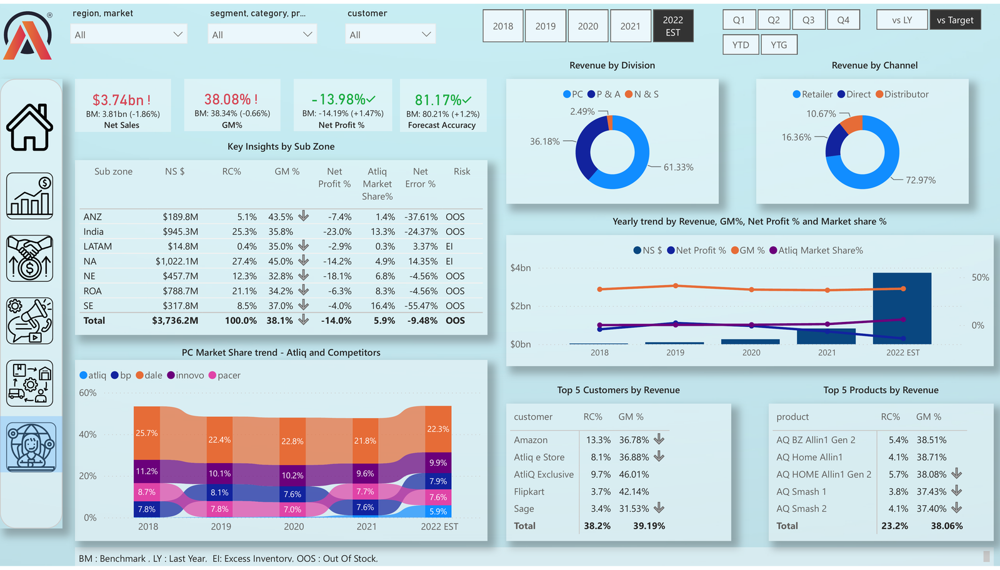
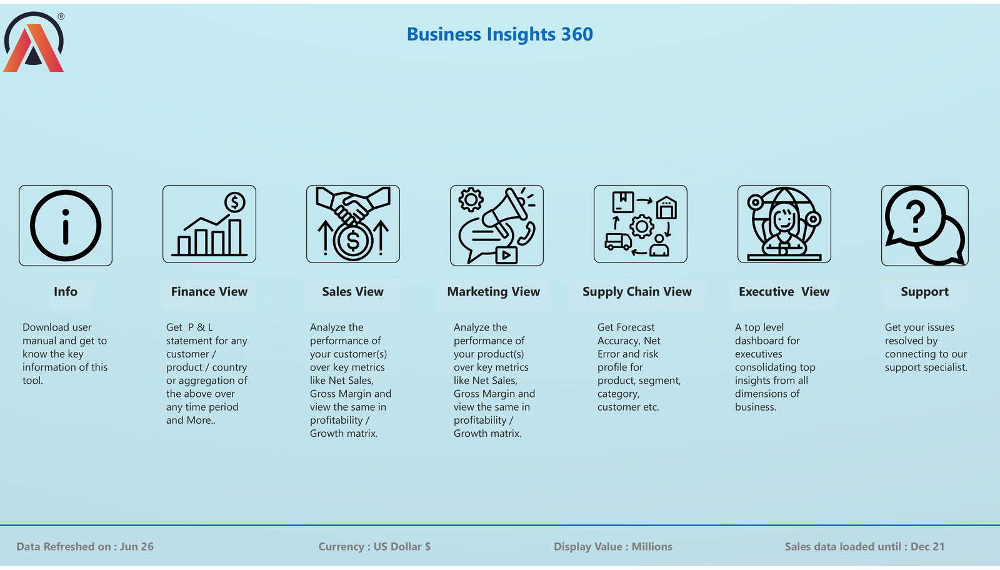
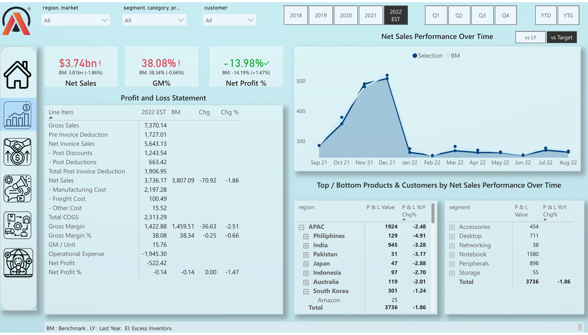
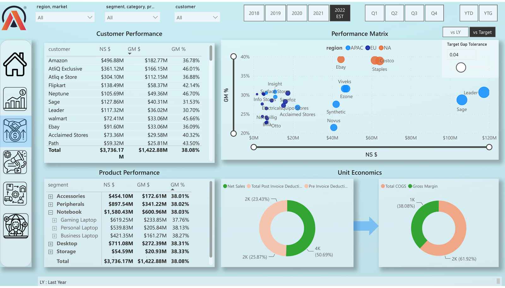
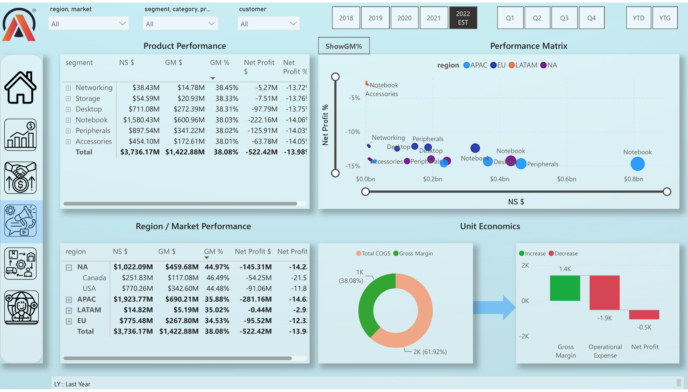
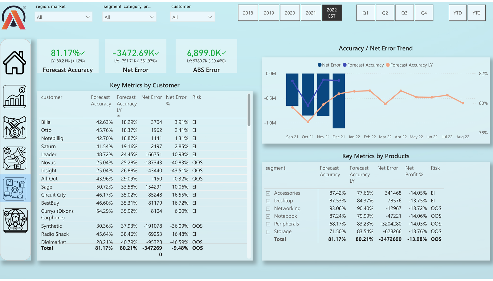

# Business Insights 360 — Power BI Dashboard

An enterprise-style, multi-page Power BI report that gives Finance, Sales, Marketing, Supply Chain, and Executive teams a single source of truth for revenue, profitability, and forecast performance — sliced by region, segment/category/product, and customer.



## Overview

Business Insights 360 consolidates P&L, sales performance, demand-forecast accuracy, and unit economics into one interactive workbook. A shared filter bar (region/market, segment/category/product, customer, year, quarter, YTD/YTG) drives every page, and each view compares actuals against **Benchmark (BM)**, **Last Year (LY)**, or **Target** on demand.

**Reporting scope (sample dataset):** FY2018–2022 (EST), values in USD millions, sales data loaded through Dec-21, last refreshed Jun-26.

## Business Problem

Consumer-electronics distributors sell the same catalog through multiple regions, channels, and customers — which means Finance, Sales, Marketing, and Supply Chain each end up building their own spreadsheets to answer overlapping questions: *Are we hitting margin targets? Which customers/products are actually profitable? Are we forecasting demand accurately enough to avoid stockouts or excess inventory?* Answering these separately is slow and the numbers rarely tie out across teams.

**Business Insights 360 solves this by putting one governed dataset behind every department's view.** A single model drives:

- **Finance** — a real-time, drillable P&L (by customer, product, or region) instead of manual reconciliation
- **Sales & Marketing** — a Profitability/Growth matrix that flags which customers and products are growing *and* profitable vs. those quietly dragging down margin
- **Supply Chain** — Forecast Accuracy and Net Error tracking that classifies risk as Excess Inventory (EI) or Out-of-Stock (OOS) *before* it becomes a costly write-off or a missed sale
- **Executives** — a single top-level view that consolidates all of the above, so leadership isn't reconciling four different reports before a decision gets made

The net result: faster, more consistent answers to "are we profitable, where, and why" — and early warning on forecast risk — without every team maintaining its own version of the truth.

## Pages

| Page | What it answers |
|---|---|
| **Info / Home** | Landing page — dataset metadata (currency, refresh date, data-load cutoff) and navigation to every view |
| **Finance View** | Full P&L waterfall (Gross Sales → Deductions → Net Sales → COGS → Gross Margin → OpEx → Net Profit) for any customer, product, or region, over any time period, vs. Benchmark |
| **Sales View** | Customer and product performance (Net Sales, Gross Margin, GM%) plotted on a Profitability/Growth matrix; unit-economics breakdown (Net Sales → Deductions, COGS → Gross Margin) |
| **Marketing View** | Product-level profitability (NS $, GM $, GM%, Net Profit %) plotted on a Profitability/Growth matrix, with region/market performance and a Gross Margin → OpEx → Net Profit bridge |
| **Supply Chain View** | Forecast Accuracy, Net Error, and ABS Error by customer and product, with Excess-Inventory (EI) / Out-of-Stock (OOS) risk flags and an accuracy trend line |
| **Executive View** | Top-level KPI summary (Net Sales, GM%, Net Profit %, Forecast Accuracy) with revenue by division/channel, a 5-year trend, market-share-vs-competitors, and Top 5 customers/products by revenue |

## Key Metrics & Definitions

| Metric | Definition |
|---|---|
| **Net Sales** | Gross Sales − Pre-Invoice Deductions − Post-Invoice Deductions (discounts + other deductions) |
| **Gross Margin (GM$ / GM%)** | Net Sales − Total COGS (Manufacturing + Freight + Other Cost) |
| **Net Profit / Net Profit %** | Gross Margin − Operational Expense |
| **Forecast Accuracy** | 1 − (\|Forecast − Actual\| / Actual), aggregated by customer/product |
| **Net Error / Net Error %** | Signed forecast bias (Forecast − Actual); flags **EI** (Excess Inventory, over-forecast) vs **OOS** (Out of Stock, under-forecast) risk |
| **BM (Benchmark)** | Internal planning/reference figure each actual is measured against |
| **RC%** | Revenue Contribution — share of total Net Sales |

## Tech Stack

- **Power BI Desktop** — data modeling, DAX measures, report authoring
- **DAX** — P&L bridge measures, YoY/vs-BM/vs-Target variance calculations, dynamic Forecast Accuracy & Net Error logic
- **Star-schema data model** — Fact table (transactions) with dimension tables for Date, Customer, Product/Segment, Region/Market, and Forecast
- **Power BI Service** — report publishing and refresh scheduling

## Dashboard Features

- Cross-filtering global slicers (region/market, segment/category/product, customer, year, quarter, YTD/YTG) synced across every page
- Toggle-driven comparisons: **vs LY** / **vs Target** / **vs Benchmark**
- Drill-down hierarchies: Region → Country, Segment → Category → Product
- Profitability/Growth scatter matrix with an adjustable Target Gap Tolerance slider
- Risk flagging (EI / OOS) built directly into the forecast tables
- Waterfall-style P&L line-item breakdown with variance (Chg / Chg%) columns

## Screenshots

| | |
|---|---|
|  Home / Info |  Finance View |
|  Sales View |  Marketing View |
|  Supply Chain View |  Executive View |

## Repository Structure

```
business-insights-360/
├── README.md
├── DAX_measures.md
├── screenshots/
│   ├── 01_home_info.png
│   ├── 02_finance_view.png
│   ├── 03_sales_view.png
│   ├── 04_marketing_view.png
│   ├── 05_supply_chain_view.png
│   └── 06_executive_view.png
└── Business_Insights_360.pbix   ← add your .pbix file here (see note below)
```

> **Note on the .pbix file:** this dashboard was built with a licensed/sample sales dataset. If the underlying data is proprietary or from a paid course, either (a) don't commit the raw `.pbix`, or (b) swap in a de-identified/sample dataset before publishing, and mention that in this README. GitHub also has a 100MB file-size limit — if your `.pbix` is larger, use [Git LFS](https://git-lfs.com/) or leave it out and describe the build here instead.

## What This Project Demonstrates

- End-to-end P&L modeling in DAX (gross-to-net sales, COGS, margin, OpEx bridges)
- Multi-dimensional variance analysis (Actual vs BM vs LY vs Target)
- Forecast-accuracy and demand-planning metrics (Net Error, EI/OOS risk classification)
- Executive-level KPI storytelling across Finance, Sales, Marketing, and Supply Chain
- Scalable star-schema data modeling and clean UX/navigation across a multi-page report

